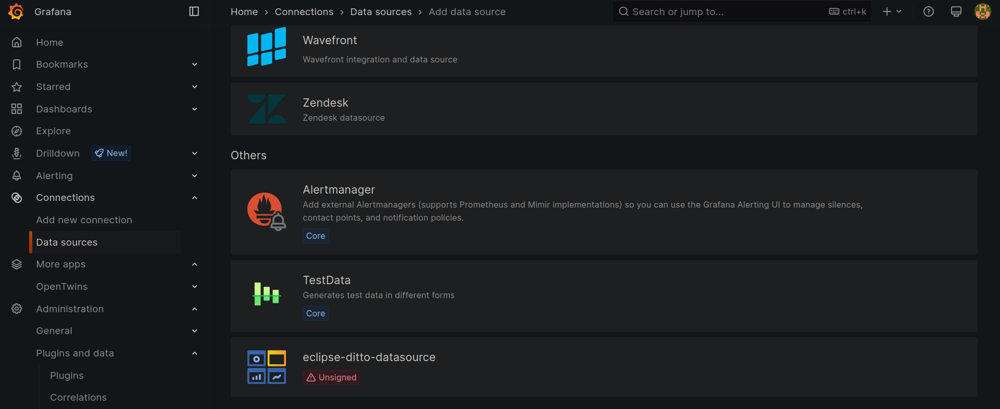
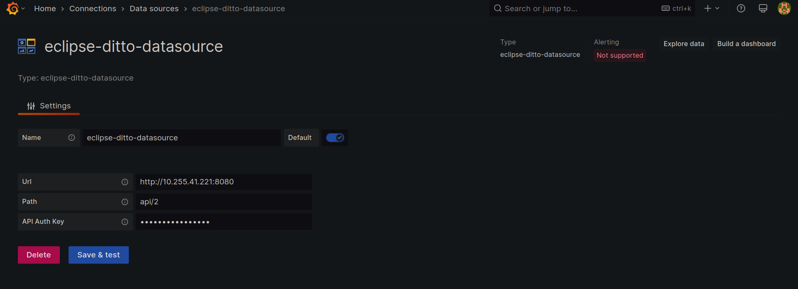
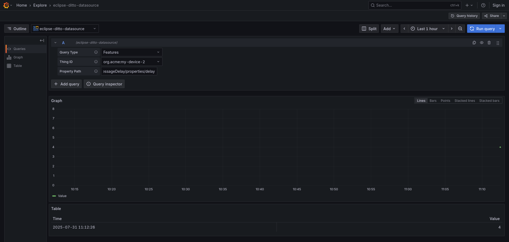
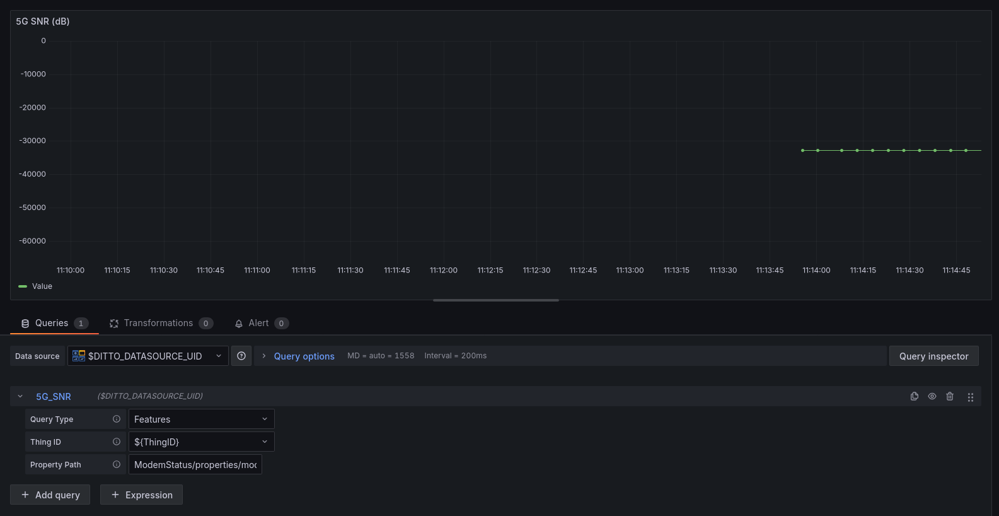
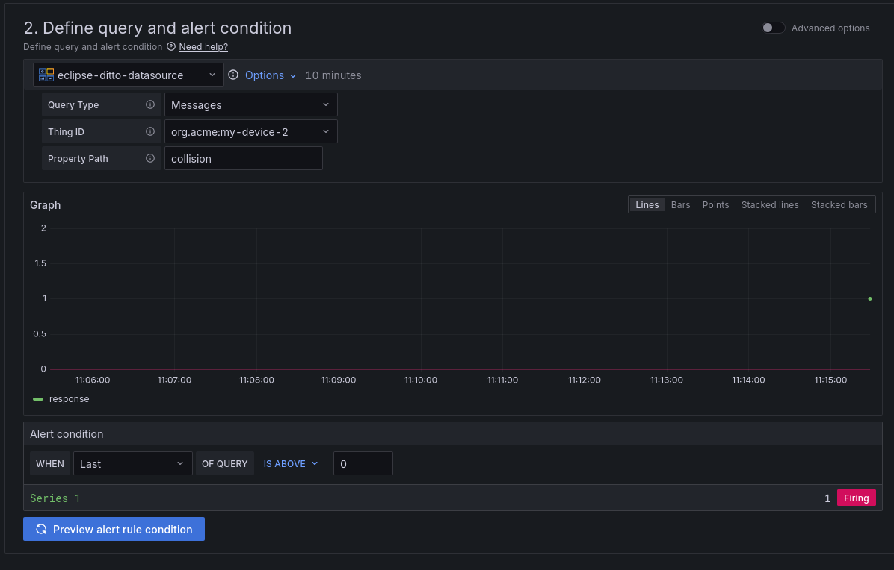

# Digital Twins plugin for Grafana

This application plugin for Grafana has been created specifically to act as a front-end to our [digital twins platform](https://github.com/ertis-research/digital-twins-platform). It allows you to manage your digital twins in a user-friendly way, with the advantage of doing it in the same tool where you can also view the state of your digital twins. Acting as a front-end, the only functionality of this plugin is to make calls to different APIs. The component on which the interface is based is our [Extended Api for Eclipse Ditto](https://github.com/ertis-research/extended-api-for-eclipse-ditto) tool, which basically acts as a top layer of [Eclipse Ditto](https://www.eclipse.org/ditto/) by adding some functionality and validation. Although this component is not very reusable for other projects due to its dependency on our platform, if the API calls are modified it could be useful as an interface for other projects or simply as an aid for the creation of a similar Grafana app plugin.

## Table of Contents

- [Changelog](#changelog)
- [Installation and activation](#installation-and-activation)
  - [Requirements](#requirements)
  - [Build plugin](#build-plugin)
  - [Activation](#activation)
- [Usage](#usage)
- [License](#license)

## Installation and activation

### Requirements

- [Grafana >= 7.0](https://grafana.com/)
- [NodeJS >= 14](https://nodejs.org/es/)
- [Go](https://go.dev/)
- [Mage](https://magefile.org/)
- [yarn](https://yarnpkg.com/)
- [Eclipse Ditto](https://www.eclipse.org/ditto/)
- [Extended API for Eclipse Ditto](https://github.com/ertis-research/extended-api-for-eclipse-ditto)

### Build plugin

This plugin is like any other Grafana plugin, so you can also follow the instructions on their page. It is also explained step-by-step below.

1. Download the code or clone it.
   ```bash
   git clone https://github.com/ertis-research/digital-twins-plugin-for-grafana.git
   ```
2. Move the code to the folder you have assigned in Grafana for plugins. This folder is indicated in the Grafana [configuration file](https://grafana.com/docs/grafana/v9.0/setup-grafana/configure-grafana/#plugins), where you can also change its path if you see it convenient.

3. The plugin is currently unsigned, so it is necessary to activate Grafana's development mode to use it. To do this, the [_app_mode_](https://grafana.com/docs/grafana/latest/setup-grafana/configure-grafana/#app_mode) variable in the Grafana configuration file must be changed to _development_ and then Grafana must be [restarted](https://grafana.com/docs/grafana/v9.0/setup-grafana/restart-grafana/).

4. Access the root folder of the code in a terminal.

5. Run the following command to install the dependencies.

   ```bash
   yarn install
   ```

6. Run the following command to build the plugin.
   ```bash
   yarn dev
   ```

7. Run the following command to build the plugin backend.
   ```bash
   mage -v build:backend
   ```

8. For Grafana to detect the plugin for the first time it usually needs to be [restarted](https://grafana.com/docs/grafana/v9.0/setup-grafana/restart-grafana/).

### Activation

At this point the plugin should already be installed. If we go into Grafana and enter `configuration > plugins`, it will be in the list.


To activate it, go to its info page (click on it) and click on _enable_.


With this, we will have our plugin installed and activated, pending configuration and use.

## Data source

In the ATNoG version, we added a data source to create dashboards fed with data from digital twins.

To achieve this, it is necessary to follow the following steps:

1. Search for the `eclipse-ditto-datasource` in the `Data Sources` section under `Connections` in the side menu, and click on it:


2. On the new page, you will need to specify how Grafana can connect to the Eclipse Ditto. Therefore, you will have to provide the URL, the path to the API (note that you can not include a `/` at the beginning of the provided path), and the auth key (base64 of `<username>`:`<password>`), as follows:


3. Finally, after you click on `Save & test`, you can create a new dashboard or explore data (in the button at the top right corner) to check if the setup was done correctly. In the last case, you will be provided with a page similar to the following example. Note that the `Thing ID` box options will automatically be filled with the things already on Eclipse Ditto.


When used in dashboards the data source supports using
[Variables](https://grafana.com/docs/grafana/latest/dashboards/variables/) with
the standard syntax.


Besides features the datasource also supports queries for the last message
received for a thing using the query type "Messages" (NOTE: message queries are
only supported for alerts).

